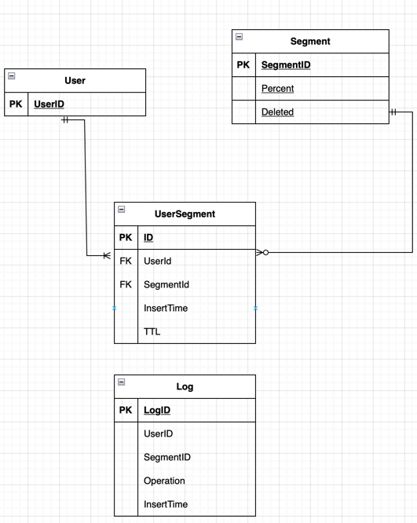

# Тестовое задание на позицию стажера Avito
___
В этом репозитории находится реализация [тестового задания](https://github.com/avito-tech/backend-trainee-assignment-2023) на позицию стажёра-бэкендера в Avito.
Микросервис написан на Go 1.21, СУБД - PostgreSQL.

#### Выполнено 
+ Основное задание
+ Доп. задание №1
+ Доп. задание №2
+ Доп. задание №3
+ Написаны тесты (покрыты хэндлеры и сервисы 99,6%)
+ Человеко-читабельные описания ошибок API
+ Документация Swagger
+ Докеризация
+ Дополнительно написаны кроны

### Запуск
___

Для запуска требуется выполнить следующие шаги:

1. Скачать исходный код и перейти в директорию с проектом:
```text
git clone https://github.com/pollykon/avito_test_task.git
cd avito_test_task
```
2. Настроить переменные окружения. В корне проекта нужно создать `.env` файл следующего содержания:
```text
PG_HOST = <хост_который_будет_использовать_бд>
PG_PORT = <порт_который_будет_использовать_бд>
PG_USER = <имя_пользователя_которое_будет_использовать_бд>
PG_PASSWORD = <пароль_который_будет_использовать_бд>
PG_DATABASE_NAME = <имя_бд>

LOGS_CSV_DIRECTORY = <директория_в_которой_будут_храниться_сгенерированные_логи>

TIME_INTERVAL_DELETE_SEGMENTS = <временной_интервал_для_удаления_сегментов>
TIME_INTERVAL_DELETE_TTL_SEGMENTS = <временной_интервал_для_удаления_сегментов_с_истекшим_ttl>
TIME_INTERVAL_DELETE_LOGS = <временной_интервал_для_удаления_старых_логов>

BATCH_SIZE_SEGMENTS = <размер_удаляемой_пачки_сегментов>
BATCH_SIZE_TTL_SEGMENTS = <размер_удаляемой_пачки_сегментов_с_ttl>
BATCH_SIZE_LOGS = <размер_удаляемой_пачки_логов>
```
3. Создать папку для логов:
```text
mkdir <директория_в_которой_будут_храниться_сгенерированные_логи>
```
4. Для развертывания dev-среды:
    + Запустить контейнер с базой данных
   ```text
    docker-compose up
    ```
   + Запустить сервер и кроны
   ```
   go run cmd/service/main.go
   go run cmd/crons/data_deleter/main.go
   ```
5. Для развертывания prod-среды:
    + Запустить контейнеры с базой данных, сервером и кронами
   ```
   docker-compose -f docker-compose.prod.yml up --build 
   ```
6. Создать таблицы в базе данных. SQL файл с созданием необходимых таблиц находится [тут](https://github.com/pollykon/avito_test_task/blob/main/migration.sql) 

### Детали реализации
___
#### Хранение в базе данных


#### Доп. задание №1
В базе данных помимо таблиц сегментов, пользователя и их связующей, существует независимая таблица с логами, в которой
хранится история удаления/добавления пользователя. При добавлении пользователя в сегмент в таблицу с логами также 
записывается информация об операции. При запросе на получение логов из таблицы достаётся информация о пользователе за 
указанный период. Далее в сервисе генерируется csv и сохраняется в файл в указанную в `.env` папку. В ответе в поле 
`url` пользователю предоставляется url, при запросе по которому отправляется содержимое указанного в запросе csv файла.
Чтобы старые логи (3 месячной давности) не занимали лишнее место, был реализован крон, который их удаляет.
#### Доп. задание №2
При добавлении пользователя в сегмент можно также указать `ttl` (задаётся в часах). При запросе на получение актуальных
сегментов пользователя, сегменты с истёкшим `ttl` передаваться не будут. Чтобы сегменты с истёкшим `ttl` не занимали
лишнее место, был реализован крон, который их удаляет.
#### Доп. задание №3
При добавлении сегмента можно указать процент пользователей, которые будут в него автоматически попадать. При получении
активных сегментов пользователя генерируется хэш `FNV32a` по его ID пользователя, от него берется остаток от деления
на 100 и сравнивается с процентами сегментов,у которых задан процент. 
### Вопросы по ТЗ и их решения
___
#### Разделение ручек на удаление и добавление пользователя 
В задании для добавления и удаления пользователя предлагалось обращаться к одной ручке. Однако мне показалось более
правильным разделить ручку на две, поскольку у одной ручки должна быть одна зона ответственности.

### Структура проекта
___
```
avito_test_task/     
├─ cmd/
│  ├─ crons/         кроны
│  ├─ service/       точка входа в сервис
├─ internal/   
│  ├─ handlers/      слой сетевого взаимодействия
│  ├─ repository/    слой взаимодействия с данными
│  ├─ service/       слой бизнес-логики
```